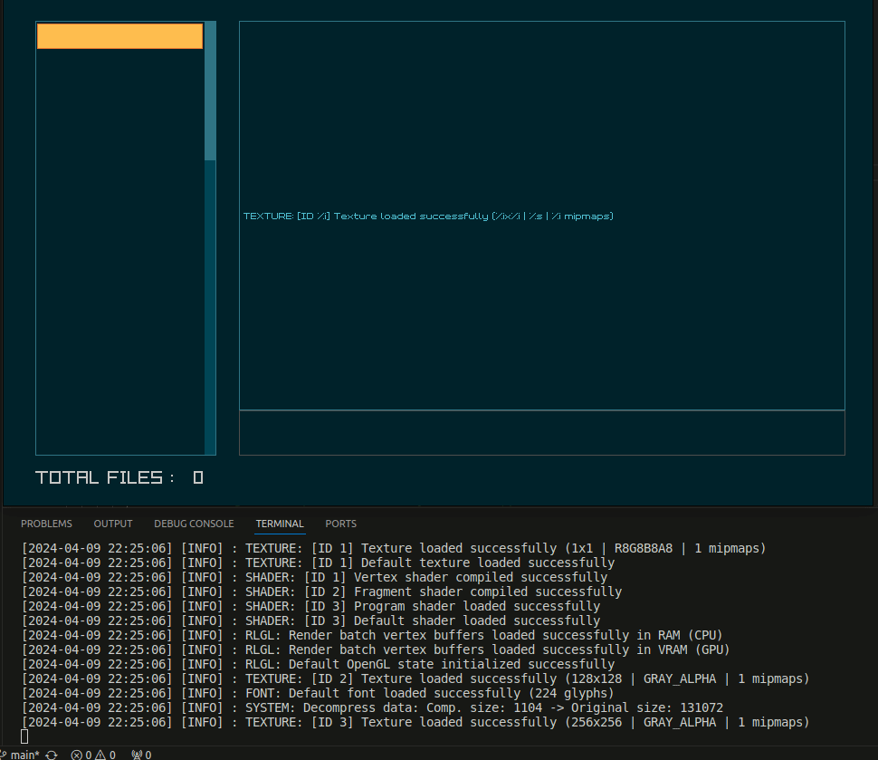

## Learning Raylib in C
With the enjoyment I am experiencing learning C. I discovered an interesting library for game development, called [Raylib](https://www.raylib.com/index.html) while watching [Tsoding's YouTube videos](https://www.youtube.com/@TsodingDaily/videos). The great thing about Raylib, is that it does not require much to get started which is why I was attracted to it in the first place.

## Project Overview 
My goal was just to see what the library has to offer. With its GUI elements, I thought of making a small dashboard application. With a console users can type commands in and a list view where users drag and drop their files into. 

Drag and dropping the files onto the window extracts the name and updates the list view. This also updates it to the a MySQL database ([testdb.sql](./testdb.sql)) with the following fields: 
* **id         ⮕ int (primary key, auto increment)**
* **name       ⮕ varchar(255)** 
* **path       ⮕ varchar(255)**
* **extension  ⮕ varchar(255)**
* **date       ⮕ datetime**

Typing **select all** uses a MySQL query to get the table values (shown in the demo below)

When the window closes, the table data from testdb will be cleared. This will require to drag and drop new files.

*As this is just a project for me to learn C and the library, it is not a fully fledged application. Meaning it's imcompleted*.

More info can be seen in the **[source code](./main.c)**.

## Resources
* [Raylib](https://www.raylib.com/index.html): 
    * Examples used:
        * [Custom logging](https://github.com/raysan5/raylib/blob/master/examples/core/core_custom_logging.c)
        * [Drag and Drop](https://github.com/raysan5/raylib/blob/master/examples/core/core_drop_files.c)
        * [Text Input Box](https://github.com/raysan5/raylib/blob/master/examples/text/text_input_box.c)
    * [RayGUI](https://github.com/raysan5/raygui?tab=readme-ov-file):
        * UI Elements used:
            * GuiListViewEx
            * GuiTextBox
            * style_cyber.h (background theme in located in the **[resource directory](./resources/style_cyber.h)**
* [GDB Debugger](https://sourceware.org/gdb/)
* [Makefile](https://www.gnu.org/software/make/manual/make.html)
* [MySQL C API](https://dev.mysql.com/doc/c-api/8.0/en/)

## Demo

